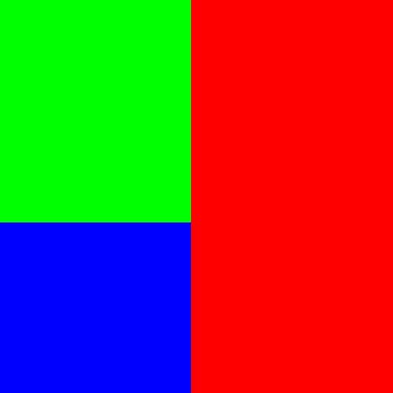

# 基于哈夫曼编码的图像压缩 / Image compression based on Huffman coding

此项目仅实现基于哈夫曼编码的图像压缩，并无过多讨论。

*暂时只能输入 24位 Bmp 图像。*

关键词：编程思维、数据结构、文件读写和 C++/Qt 的代码能力。

This project only implements image compression based on Huffman coding, without much discussion.

*Only 24-bit Bmp images can be entered for now.*

Key Words: Programming Thinking, Data Structures, File Reading and Writing, C++/Qt Coding

## 开发环境 / Development environment

- Visual Studio 2022
- Qt 6.6.1_msvc2019_64

## 项目结构 / Project structure

- example: 测试样例 / Test cases
- src: 源代码 / source codes

## 效果展示 / Effect display

<table>
    <caption>
		<strong>测试1 / Test1：lena.bmp</strong>
	</caption>
    <tr>
        <td>lena.bmp : 733 KB</td>
       	<td>lena.huf : 673 KB</td>
        <td>lena.jpg : 38 KB</td>
        <td>lena.png : 403 KB</td>
    </tr>
</table>

压缩率(之后/之前) / Compressibility (After/Before): 91.81%

<table>
    <caption>
		<strong>测试2 / Test2：RGB.bmp</strong>
	</caption>
    <tr>
        <td>RGB.bmp : 733 KB</td>
       	<td>RGB.huf : 92 KB</td>
        <td>RGB.jpg : 7 KB</td>
        <td>RGB.png : 2 KB</td>
    </tr>
</table>

压缩率(之后/之前) / Compressibility (After/Before): 12.55%

<table>
    <caption>
		<strong>测试3 / Test3：butterfly.bmp</strong>
	</caption>
    <tr>
        <td>butterfly.bmp : 733 KB</td>
       	<td>butterfly.huf : 92 KB</td>
        <td>butterfly.jpg : 7 KB</td>
        <td>butterfly.png : 2 KB</td>
    </tr>
</table>

压缩率(之后/之前) / Compressibility (After/Before): 92.23%
